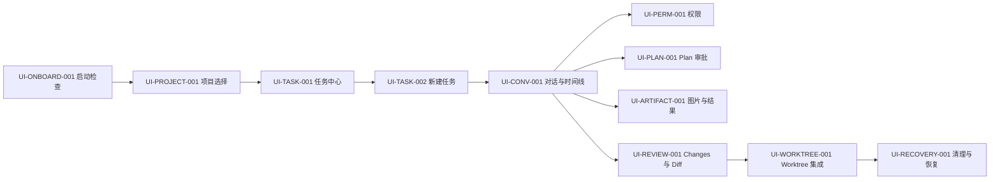
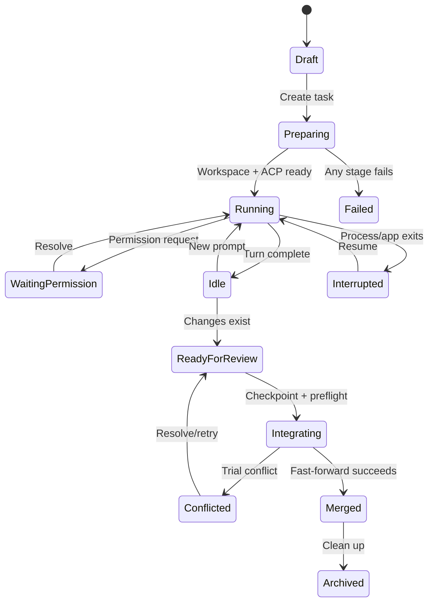
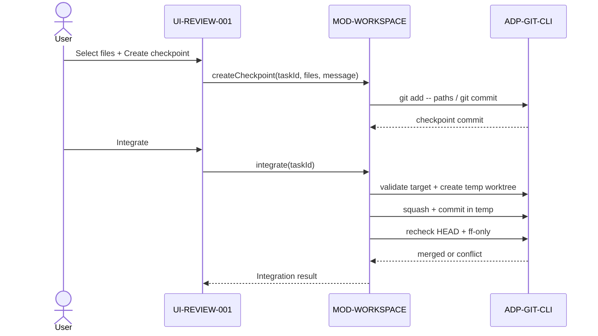

# Grok ACP GUI UI/UX 设计规范

## 1. 体验目标

界面应像“任务控制台”，而不是普通聊天机器人或缩水 IDE。对话是主轴，但用户随时能判断：Agent 在哪里工作、是否等待操作、修改了什么、能否安全合并，以及失败后如何恢复。

设计原则：

- **可观察**：工具、权限、变更、分支和状态持续可见。
- **安全默认**：写入型任务默认隔离；危险动作说明目标与恢复路径。
- **渐进披露**：常用流程简单，高级 Git/诊断信息按需展开。
- **状态诚实**：区分 running、waiting、interrupted、failed 和 conflicted。
- **无色盲陷阱**：颜色、图标和文字共同表达状态。

## 2. Design Token

### 2.1 Catppuccin Mocha 色板

任务中心、审查、恢复和壳层仍用本表。对话面（时间线、任务条、Composer、Conversation rail）改用 Rose Pine Moon，见 [ADR-0003](adr/ADR-0003-conversation-uses-grok-build-theme.md)。

| Token | Hex | 用途 |
|---|---|---|
| `--ctp-crust` | `#11111b` | 最深窗口区域、标题栏 |
| `--ctp-mantle` | `#181825` | 左右侧栏、浮层背景 |
| `--ctp-base` | `#1e1e2e` | 主内容背景 |
| `--ctp-surface0` | `#313244` | 输入框、卡片、静止控件 |
| `--ctp-surface1` | `#45475a` | Hover、边框强调 |
| `--ctp-surface2` | `#585b70` | Active 边框、分隔 |
| `--ctp-overlay0` | `#6c7086` | 禁用文本 |
| `--ctp-subtext0` | `#a6adc8` | 次要文本 |
| `--ctp-text` | `#cdd6f4` | 正文 |
| `--ctp-mauve` | `#cba6f7` | 主操作、选中、品牌强调 |
| `--ctp-blue` | `#89b4fa` | 链接、信息、运行状态 |
| `--ctp-green` | `#a6e3a1` | 成功、可合并 |
| `--ctp-yellow` | `#f9e2af` | 警告、待审批 |
| `--ctp-red` | `#f38ba8` | 错误、拒绝、破坏性操作 |
| `--ctp-peach` | `#fab387` | 冲突、资源过载 |

### 2.2 尺寸与排版

- 字体：`Segoe UI Variable`、`Segoe UI`、系统无衬线；代码使用 `Cascadia Code`。
- 正文 14 px/20 px；辅助 12 px/16 px；标题 20/28、16/24、14/20。
- 间距单位 4 px；常用 8、12、16、24、32 px。
- 圆角：控件 6 px，卡片 8 px，弹窗 12 px。
- 边框：1 px `surface0`；Active 使用 `surface2` 或 Mauve。
- 最小命中区 32×32 px；主要按钮高度 36 px。
- 动画 120–180 ms；`prefers-reduced-motion` 时关闭位移/缩放动画。

## 3. 信息架构



## 4. 主窗口布局

默认尺寸 1440×900，最小尺寸 1024×680。

```text
┌─────────────────────────────────────────────────────────────────────┐
│ Project ▾  branch/worktree  Grok ●        Search  Settings  New Task │ 48
├──────────────┬───────────────────────────────────┬───────────────────┤
│ 左栏 260     │ 中栏 min 520                      │ 右栏 380          │
│ Projects     │ Task header                       │ Changes           │
│ Running      │ Conversation / Plan / Tool cards  │ Diff              │
│ Attention    │                                   │ Artifacts         │
│ Review       │                                   │ Worktree          │
│ Completed    │ Composer + image chips            │ Recovery          │
├──────────────┴───────────────────────────────────┴───────────────────┤
│ 状态栏：cwd · session · model · reasoning · diagnostics             │ 28
└─────────────────────────────────────────────────────────────────────┘
```

- 左栏默认 260 px，可调 220–360 px。
- 右栏默认 380 px，可调 320–600 px，无内容时折叠。
- 1200 px 以下先折叠右栏为抽屉；1080 px 以下左栏变窄至 220 px。
- 中栏始终至少 520 px，Composer 固定底部但不遮挡时间线。

## 5. 界面规格

### 5.1 UI-ONBOARD-001 启动检查

按顺序显示 Git、Grok、版本、认证、数据库和可写目录检查。每项有 `checking/success/warning/error`，错误必须带主要动作和复制诊断。

- Grok 缺失：显示官方安装说明与“重新检测”。
- 未登录：显示“登录 Grok”，启动外部流程后轮询。
- 版本过低：显示当前/最低版本和升级命令。
- 数据迁移失败：阻止进入应用，提供日志位置，不允许跳过。

### 5.2 UI-PROJECT-001 项目选择

- 最近项目卡片：名称、路径、分支、最后打开时间、可访问状态。
- “打开文件夹”使用系统选择器。
- 首次打开显示信任确认：Agent 可能读写文件和执行命令；显示绝对路径。
- 非 Git 项目标记“无 Git”；隐藏 Worktree/集成能力但保留 Ask/Agent。

### 5.3 UI-TASK-001 任务中心

任务按 Running、Needs attention、Review、Completed 分组。每行显示：状态图标、标题、Worktree/当前目录、分支、最后活动、Diff 统计。

状态表达：

- Running：蓝色旋转环 + “运行中”。
- Waiting permission：黄色盾牌 + “等待审批”。
- Interrupted：Peach 插头 + “已中断，可恢复”。
- Ready for review：绿色 Diff 图标 + “待审查”。
- Conflicted：红/Peach 分支图标 + “集成冲突”。

### 5.4 UI-TASK-002 新建任务

弹窗宽 640 px，分三段：目标与附件、模式与模型、工作目录。

- Prompt 必填；标题可由首行生成并可编辑。
- 图片 chip 显示缩略图、名称、大小、移除。
- 模式选 Agent/Plan/Ask；模型与 reasoning 从 capability 获取。
- 工作目录智能默认：Agent/Plan 为隔离，Ask 为当前目录。
- 脏工作区切换“当前目录”时显示黄色风险说明。
- 隔离模式显示基础分支、生成的分支预览和 Worktree 根目录。

### 5.5 UI-CONV-001 对话与工具时间线

- 用户、Agent 消息按时间线排列；Agent 消息支持 Markdown、代码块复制和文件链接。
- 思考默认折叠，只显示“Thinking…”和耗时；仅呈现 ACP 允许显示的内容。
- 同一批只读工具折叠为“Explored N items”；编辑和命令保持独立可审计卡片。
- 命令卡显示 cwd、命令、状态、耗时、退出码和可展开输出。
- 编辑卡显示文件、增删行和“在 Diff 中查看”。
- 未知工具显示通用名称、状态和结构化详情，不渲染未经转义的 HTML。
- Composer 支持 Enter 发送、Shift+Enter 换行、Esc 停止当前 Turn。

### 5.6 UI-PERM-001 权限审批

权限卡插入时间线并提升到左栏 Needs attention。显示工具类别、作用域、命令/路径摘要、风险说明和 ACP 选项。

- 默认焦点在最安全的非破坏性选项或拒绝；不得默认聚焦永久/会话允许。
- 选项文字使用 Agent 提供标签，内部保存 option ID。
- 进程退出后卡片变为“请求已失效”，按钮禁用。

### 5.7 UI-PLAN-001 Plan 审批

- Plan 以编号步骤、状态和可选评论呈现。
- 顶部明确显示“规划阶段：写入与非只读命令已阻止”。
- 底部动作按 capability 显示批准、继续规划、取消。
- 批准后状态条切换为 Agent，并记录审批事件。

### 5.8 UI-ARTIFACT-001 图片与结果

- 输入支持 Ctrl+V、拖放和选择器；拖放时显示全 Composer drop zone。
- 缩略图 72×72，GIF 静态缩略图但全图可播放。
- 超过 20 MiB、伪造 MIME 或不支持格式时就地错误，不创建空 chip。
- 右栏 Artifacts 展示来源消息、时间、尺寸、保存和打开位置。
- 缓存缺失用带重试/定位说明的占位，不显示破图图标。

### 5.9 UI-REVIEW-001 Changes 与 Diff

- Changes 列表显示 checkbox、状态、路径、+/-、binary/large badge。
- 默认不替用户自动选择；提供 Select all/None。
- 单击文件打开 Monaco 双栏 Diff；窄窗口使用 inline Diff。
- 删除、重命名、二进制和过大文件有专用降级视图。
- “Create checkpoint” 显示已选/未选数量、提交信息和 Git identity 状态。

### 5.10 UI-WORKTREE-001 Worktree 集成

- 展示基础分支/HEAD、任务分支、Worktree 路径、提交和脏状态。
- 外部 Worktree 显示“外部，只读管理”；接管需要二次确认。
- 集成前 Checklist：目标干净、分支匹配、HEAD 未变、检查点存在、仓库锁可用。
- 运行中显示阶段：Preparing → Trial squash → Commit → Recheck → Fast-forward。
- 冲突时显示冲突文件和临时 integration 路径，原工作区标记“未修改”。

### 5.11 UI-RECOVERY-001 清理与恢复

- 普通清理仅在已合并且干净时为主按钮。
- 强制丢弃是红色三级确认：显示路径、未合并提交、未跟踪文件和恢复包内容。
- 恢复包未创建成功时按钮保持不可用。
- Recovery 列表显示任务、仓库、创建/到期时间、bundle/patch/untracked 组成和 Restore/Delete。

### 5.12 UI-SETTINGS-001 设置与诊断

- Grok 路径、受管 Worktree 根目录、日志级别、字体缩放和“显示思考”开关。
- Theme v1 默认 Mocha，不显示虚假的主题选择器。对话面色源见 [ADR-0003](adr/ADR-0003-conversation-uses-grok-build-theme.md)（Rose Pine Moon）；任务中心、审查、恢复等页面本期仍用 Mocha。
- 诊断页显示应用/Grok/Git/WebView2 版本和日志位置；复制内容必须先脱敏。

### 5.13 UI-ERROR-001 全局错误与启动阻断

- 用于 Migration 失败、数据目录不可写、Runtime/WebView 不兼容及无法建立 DesktopBridge 等无法由局部组件承载的错误。
- 页面必须显示稳定错误码、用户可理解的影响、已脱敏诊断摘要，以及“重试”“打开诊断目录”“安全退出”等实际可用操作。
- 不得创建空数据库或新配置来掩盖原数据读取失败；涉及升级失败时优先保全旧数据并指向 Recovery Center。
- 默认焦点位于安全操作，复制诊断前再次脱敏；堆栈、密钥、完整用户名和敏感绝对路径不直接展示。

## 6. 关键流转



图中 TitleCase 是展示标签；Bridge、领域和 SQLite 使用 PRD FR-TASK-003 规定的 snake_case 枚举。Plan 等待复用 `waiting_permission`，以 `wait_reason=plan` 区分，不创建第二套 Task 状态。



## 7. 可访问性与键盘

- Tab 顺序：全局栏 → 左栏 → 时间线 → Composer → 右栏。
- `Ctrl+N` 新任务，`Ctrl+P` 项目切换，`Ctrl+Shift+P` 命令面板，`Ctrl+.` 聚焦待审批，`Esc` 停止/关闭当前浮层。
- 所有图标按钮有 accessible name 和 Tooltip。
- 状态文本不因缩放到 200% 被截断；三栏在 200% 时退化为抽屉布局。
- Diff 增删除颜色外提供 `+/-` 标记、行号和可读标签。

## 8. UI 验收

- 每个 FR 用户流都有对应 UI 或明确声明“无 UI”。
- 所有任务状态均有图标、文字和颜色。
- 1024×680、1440×900 和 200% 缩放下无不可达关键操作。
- 键盘可完成登录重检、新任务、发送、审批、查看 Diff 和取消。
- destructive dialog 精确显示目标绝对路径与恢复状态。
- Mocha Token 不出现散落硬编码替代值。
