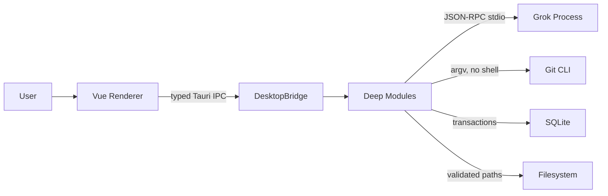
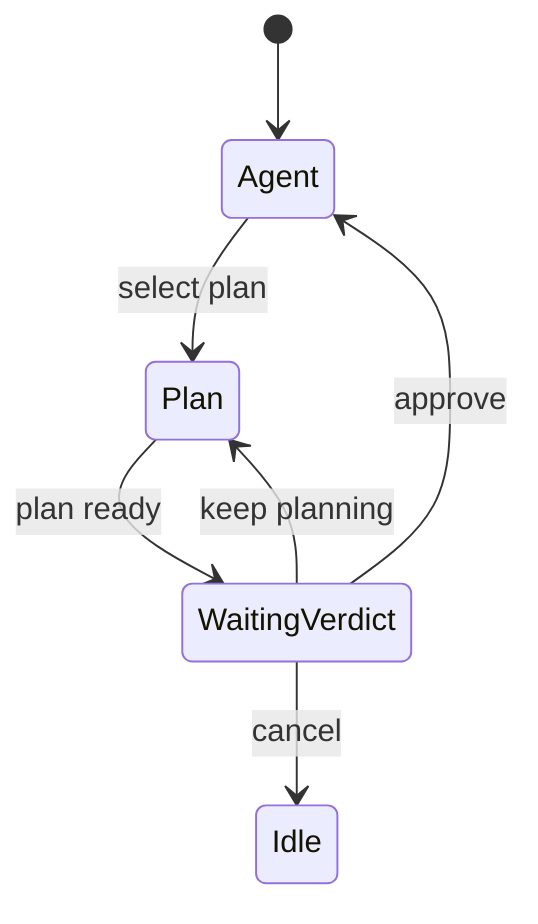

# Grok ACP GUI 技术方案

## 1. 设计目标

该架构把 Grok/ACP、任务编排、Git/Worktree、Artifact 和持久化的复杂性压入五个深模块，通过单一 DesktopBridge seam 向 Renderer 提供稳定 Interface。调用方不需要理解 JSON-RPC、进程、Git 命令、SQLite 或 Windows 路径细节。

## 2. 技术栈与基线

- 开源基线：使用 [formulahendry/acp-ui](https://github.com/formulahendry/acp-ui) 的 [v0.1.16](https://github.com/formulahendry/acp-ui/releases/tag/v0.1.16) 源码快照，固定 commit `cd9c3cb464a4b321bff652101953a64c07473e31`，保留 MIT License、原作者版权和上游 URL/tag/commit 来源记录；GAG-001 必须再次校验 tag 指向与许可证，变化时停止报告。根据 [ADR-0001](adr/ADR-0001-upstream-provenance-without-shared-ancestry.md)，固定 commit 不要求属于产品仓库的 Git 祖先链。
- 桌面：Tauri 2，Windows 10/11，WebView2。
- 后端：Rust stable-msvc、Tokio、Serde、Rusqlite。
- 前端：Vue 3、TypeScript、Pinia、Vite。
- ACP：`@agentclientprotocol/sdk` 维持 Fork 基线版本，真实契约通过后再升级。
- Diff：Monaco Editor，仅预览/Diff，不提供文件编辑器。
- 测试：Vitest、Vue Test Utils、Rust tests、Fake ACP、临时 Git 仓库、Windows E2E。

## 3. 目标目录

```text
grok-acp-gui/
├── AGENTS.md
├── README.md
├── LICENSE
├── package.json
├── package-lock.json
├── tsconfig.json
├── vite.config.ts
├── index.html
├── docs/
│   ├── 01-PRD.md
│   ├── 02-UI-UX-DESIGN.md
│   ├── 03-TECHNICAL-DESIGN.md
│   ├── 04-AI-DEVELOPMENT-ROADMAP.md
│   ├── tasks/
│   └── adr/
├── assets/
│   ├── icons/
│   └── screenshots/
├── src/
│   ├── app/{bootstrap,routing,state}/
│   ├── bridge/{desktop-bridge,commands,events,types}.ts
│   ├── features/{onboarding,task-center,conversation,review,worktrees,settings}/
│   └── shared/{ui,theme,icons,utilities}/
├── src-tauri/
│   ├── Cargo.toml
│   ├── tauri.conf.json
│   ├── capabilities/
│   ├── migrations/
│   └── src/
│       ├── bridge/
│       ├── domain/
│       ├── modules/{agent_runtime,task_runtime,workspace,artifacts,persistence}/
│       ├── adapters/{grok_acp,git_cli,filesystem,sqlite}/
│       ├── app.rs
│       └── lib.rs
├── tests/{fake-acp-agent,fixtures,e2e}/
└── .github/{workflows,pull_request_template.md}
```

依赖方向只允许：`features → bridge → Rust bridge → modules → adapters`。`domain` 可被 modules 与 bridge DTO 映射使用，但不能依赖 Adapter。不同 Feature 通过应用状态或 Bridge 事件协作，不互相导入内部 Store。

## 4. 深模块与 Interface

### MOD-AGENT-RUNTIME

职责：Runtime 探测、登录启动、ACP 进程、会话、Turn、配置、权限、Plan、事件规范化和恢复。

外部 Interface：

```rust
trait AgentRuntime {
    async fn probe(&self) -> RuntimeStatus;
    async fn open_session(&self, input: OpenSession) -> SessionSnapshot;
    async fn execute(&self, command: AgentCommand) -> Result<AgentResult, AppError>;
    fn subscribe(&self) -> EventReceiver<AgentEvent>;
}
```

Implementation 内部可使用生产 Grok ACP Adapter 和 Fake ACP Adapter，因此 seam 真实存在。调用方不接触 ACP request id、JSON-RPC 或 child handle。

### MOD-TASK-RUNTIME

职责：Project/Task 生命周期、状态机、并发协调、资源警告、会话与 Workspace 绑定、崩溃恢复。

```rust
trait TaskRuntime {
    async fn bootstrap(&self) -> BootstrapSnapshot;
    async fn execute(&self, command: TaskCommand) -> Result<TaskResult, AppError>;
    fn subscribe(&self) -> EventReceiver<TaskEvent>;
}
```

### MOD-WORKSPACE

职责：仓库检查、Worktree、Changes、Diff、检查点、集成、仓库锁和清理条件。

```rust
trait WorkspaceModule {
    async fn inspect(&self, root: PathBuf) -> Result<WorkspaceSnapshot, AppError>;
    async fn execute(&self, command: WorkspaceCommand) -> Result<WorkspaceResult, AppError>;
}
```

Git CLI Adapter 与测试 Git Fixture 通过内部 seam 替换；对 Renderer 不暴露 Git 命令。

### MOD-ARTIFACTS

职责：图片导入、MIME/大小校验、哈希、缩略图、安全 URL、结果保存、恢复包和保留期。

### MOD-PERSISTENCE

职责：Migration、事务、实体存取、启动恢复和设置。只暴露领域读写操作，不暴露 SQL。

## 5. DesktopBridge Interface

Renderer 仅使用：

```ts
export interface DesktopBridge {
  bootstrap(): Promise<BootstrapSnapshot>;
  execute(command: DesktopCommand): Promise<DesktopResult>;
  subscribe(listener: (event: DesktopEvent) => void): Promise<Unsubscribe>;
}
```

GAG-001 在正式 Interface 落地前只暴露以下临时启动契约：

```ts
export interface BootstrapStatus {
  productName: string;
  version: string;
  platform: string;
  ready: boolean;
}

export function bootstrap(): Promise<BootstrapStatus>;
```

Rust `bootstrap` command 返回同名字段并通过 `camelCase` 序列化；该 DTO 不承载 Runtime、ACP、项目或持久化状态，不发布事件，必须在 GAG-003 中由正式 `BootstrapSnapshot` 契约替换。

命令联合类型涵盖：

- `runtime.refresh`、`runtime.login`
- `project.open`、`project.forget`
- `task.create`、`task.open`、`task.archive`
- `turn.send`、`turn.cancel`、`session.configure`、`session.resume`
- `permission.resolve`、`plan.resolve`
- `artifact.import`、`artifact.save`
- `workspace.inspect`、`worktree.adopt`
- `review.diff`、`review.checkpoint`
- `integration.preflight`、`integration.execute`
- `worktree.cleanup`、`recovery.restore`、`recovery.delete`

事件联合类型：`runtime.updated`、`task.snapshot`、`task.state`、`message.delta`、`activity.updated`、`permission.requested`、`plan.updated`、`changes.updated`、`artifact.available`、`resource.warning`、`diagnostic.notice`。

`BootstrapSnapshot.capabilities.models` 的 `ModelInfo` 包含 `modelId`、`name`、可选 `description` 和可选 `reasoningEffort`。`reasoningEffort` 只来自 Grok `config.toml` 对应 `[model.*]` profile 的 `reasoning_effort`，当前允许 `low`、`medium`、`high`、`max`；Renderer 选择 profile 时同步该默认值，字段缺失时保持兼容默认，不得按模型名称猜测。

所有会话事件携带 `taskId`、`sessionId`、单调 `seq` 和 timestamp。Renderer reducer 丢弃已处理 seq；缺口触发 snapshot refresh，不能猜测缺失内容。

GAG-009 将 `permission.resolve` 固定为 `{ taskId, sessionId, requestId, correlationId, expectedVersion, optionId }`，其中非 Plan 请求使用 `expectedVersion=0`；`plan.resolve` 使用同一上下文字段且 `expectedVersion>0`。后端逐字段核对当前 Session、Workspace 和 Plan 版本，原样回传 `optionId`。Renderer 不接收审批令牌、operation digest 或持久 scope 规则。

`permission.requested` 仅发送脱敏后的结构化操作视图：类别、可执行文件、脱敏参数、cwd、读写路径、风险、过期时间以及 ACP 原始 option ID/显式 kind。缺失或未知 kind 可以显示但不可授权，禁止从 label 猜测语义。`plan.updated` 的 proposed 载荷包含 request/correlation/version、摘要、步骤和原始选项；新版本把旧卡标记为 superseded。

GAG-010C 将 `artifact.save` 固定为单文件契约 `{ taskId, artifactId, targetPath, overwrite }`。`targetPath` 只能来自 Renderer 通过系统保存对话框取得的用户选择；`overwrite` 首次必须为 `false`，后端返回 `conflict` 后由用户明确确认才可重试为 `true`。返回 `ArtifactSaveResult.status` 为 `saved|cancelled|conflict|rejected|failed`，不返回受管源路径或文件正文。`artifact.reveal` 可选携带同一已选择目标路径；后端验证该目标仍与受管 Artifact 的大小及 SHA-256 一致后，仅在资源管理器中定位，不执行文件。批量保存和目录替换不在该契约内。

GAG-011 增加 `worktree.create`、`worktree.inspect`、`worktree.reconcile`、`worktree.prepareRemoval`、`worktree.prepareAdoption` 和 `worktree.remove`。创建请求中的 repo、slug 与 base ref 均视为低信任提示；后端必须从持久化 Task → Project 关系重新派生仓库、任务标题与当前 base，并拒绝 common git dir 不一致的请求。删除必须先取得一次性、十分钟有效的 prepare token，再把 UI 展示的准确绝对路径逐字回传；未合并或 dirty 时还必须明确确认强制清理并依赖已验证恢复包。token、task、登记记录、Git porcelain、repo identity、relative path、canonical managed-root 证明、prepare 后内容指纹和恢复包 hash 任一不一致都拒绝删除。外部 Worktree 接管同样使用十分钟 prepare token 与准确路径二次确认，但保持 `adopted` 所有权，不能进入受管删除。旧 `worktree.cleanup(force)` 不承载这些证明，继续 fail-closed，不作为删除入口。

任务启动与清理使用 SQLite `IMMEDIATE` 事务协调：任务只能在登记 Worktree 为 `ready|dirty|active` 时进入运行态，清理只能在任务不含 live process 状态时把同一登记原子切换为 `closing`。先完成的一方阻止另一方，消除 ACP 启动与 `git worktree remove` 的 TOCTOU。对账同时返回未登记的外部 Worktree（只读、不可清理）；只有显式绑定到同仓库 Task 后才登记为 `adopted`。

GAG-008 的规范化会话载荷如下：用户与 Assistant 文本使用 `message.delta` 的 `{ role, text }`；工具生命周期同样使用 `message.delta`，载荷为 `{ toolCall }`，其中只允许显示 `toolCallId`、标题、种类、状态、位置、脱敏后的输入/结果摘要、起止时间和耗时，不得包含 ACP `rawInput`/`rawOutput`。Turn 正常完成发布 `task.state(status="idle", detail.completed=true)`；用户停止发布 `task.state(status="idle", detail.reason="cancelled")`；请求失败发布 `activity.updated({ kind: "error", code, detail, retryable })` 并把 Renderer 会话终止为可恢复的 `error`；进程异常退出发布并持久化 `task.state(status="interrupted")`，包括空闲但仍可复用的 ACP 子进程异常退出；只有运行时已进入受管 shutdown 的 clean exit 才保留 idle。`task.open` 返回持久化后的 `{ taskId, sessionId?, title, status, mode?, model?, reasoning?, workspaceStrategy, workspaceAvailable, cursor, events, attempt }`；其中 `workspaceAvailable` 只能由后端对持久化策略和规范化路径进行验证后给出，Renderer 不推导真实 cwd。Renderer 必须先应用该快照再接收增量事件。为避免长回复的数千个流式 chunk 使快照失真或超限，后端读取完整 append-only 会话日志，把连续 Assistant delta 压缩成保留原始末尾序号的单个安全显示事件；因此快照内事件序号允许稀疏，`cursor` 才是快照与后续实时增量之间的权威连续性边界。

## 6. 信任边界与权限



- Renderer 是低信任 UI，不持有密钥和任意命令能力。
- Bridge 对 enum、ID、路径和大小做结构验证。
- Module 执行业务授权：任务与 Workspace 绑定、受管路径、状态迁移、Plan gate。
- Adapter 执行最小外部操作并返回结构化结果。
- Grok 权限审批不替代本地 Plan gate、路径限制和 Worktree 删除前置条件。

## 7. ACP 与进程生命周期

1. Runtime 按配置、默认安装路径、PATH 探测 Grok。
2. 启动 `grok --no-auto-update agent [--model <profile-id>] stdio`，stdin/stdout pipe，stderr 独立读取。Task 保存的模型 profile 在 session 启动时以独立 argv 参数传入；ID 只允许受限字符且不得形似 CLI option，非法值以 `RUNTIME_INVALID_MODEL` fail-closed，不能静默回落到默认模型。
3. 初始化协议并记录 capability；不支持的 UI 功能隐藏或禁用。
4. 每个正在执行的 Task 使用独立 ACP 进程以隔离崩溃和 cwd。
5. 一个 Task 同时最多一个 Turn；任务数量不设上限。
6. Turn 完成后 session 持久化；进程空闲 5 分钟或用户关闭任务时终止。
7. 下一次操作重新启动进程并以 session ID、原 cwd resume。
8. 第 4 个并行 Turn 起发 `resource.warning`，不拒绝启动。
9. 应用最终退出事件同步调用 `AgentRuntime.shutdown_all`；每个 session 先关闭 stdin 并等待宽限期，超时则中止 process monitor，由 `kill_on_drop` 终止 Child。Runtime 内部转发任务只持有 Weak 引用，不得形成阻止清理的 Arc 循环；Windows Job Object/等价的进程树约束仍是生产 Adapter 的安全要求。

事件规范化：ACP option ID 原样保留；未知 update 存为 `activity.updated(kind="unknown")`；stderr 不进入协议解析器。

## 8. Plan 与权限状态机



Plan 状态下，所有文件写入和非只读终端请求在客户端权限处理器被拒绝，即使 Agent 提供允许选项。批准事件成功提交给 ACP 后才解除 gate。进程退出时未决权限统一变为 expired。

`ExecutionGuard.authorize(OperationDescriptor, ExecutionContext)` 是后续进程、文件和 Git Adapter 的统一执行边界。分类矩阵为：显式只读 allowlist → `read_only`；文件/Git 变更 → `write`；删除、清理和 reset → `destructive`；字段缺失、shell 拼接、未知命令或路径逃逸 → `unknown`。`unknown` 永远拒绝。一次批准证据绑定 task/session/workspace/operation digest/plan version/expiry，并由 SQLite 原子消费；Plan 阶段仅声明的只读探测可不经批准执行。ACP 提交与数据库状态变更由后端互斥串行，只有 ACP 提交成功后本地状态才进入 approved。

## 9. SQLite 设计

Migration 版本从 `0001_initial.sql` 开始，使用事务。核心表：

- `projects(id, path, repo_root, trusted_at, last_opened_at)`
- `tasks(id, project_id, title, status, workspace_kind, mode, model, reasoning, created_at, updated_at)`
- `session_bindings(task_id, session_id, cwd, last_seq, state)`
- `worktrees(id, task_id, repo_root, path, branch, base_branch, base_commit, ownership, state)`
- `attachments(id, task_id, sha256, mime, bytes, cache_path, source_name, created_at)`
- `recovery_items(id, task_id, directory, manifest_path, expires_at, state)`
- `settings(key, json_value)`
- `plans(request_id, task_id, session_id, correlation_id, workspace, version, plan_hash, state, summary_redacted, options_json, decided_option_id, created_at, updated_at)`
- `permission_decisions(request_id, task_id, session_id, correlation_id, workspace, plan_version, operation_digest, category, summary_redacted, options_json, state, scope_json, expires_at_epoch, decided_option_id, consumed_at, created_at, updated_at)`
- `approval_audit_events(task_id, session_id, request_id, event_kind, decision, operation_digest, plan_version, correlation_id, occurred_at)`

唯一约束：规范化 project path、session_id、受管 worktree path、attachment sha256。任务、Worktree 与恢复状态更新采用事务。ACP 是消息历史事实来源；DB 不复制完整对话正文。

Migration `0003_permissions_and_plans.sql` 只保存 hash、脱敏摘要和决策元数据，不保存原始敏感参数或 Renderer 可复用令牌。新 Plan 版本在同一事务中 supersede 旧 Plan 并使旧批准失效；一次批准以条件 UPDATE 原子转为 consumed。

Migration `0004_worktree_lifecycle.sql` 只追加 Worktree 生命周期列：repo identity、common git dir、受管相对路径、创建/最近校验时间、恢复包关联、磁盘占用、locked 与 merged。既有 Migration 不修改；旧记录使用安全默认值并在破坏性操作前通过 Git 与文件系统重新对账。

## 10. Worktree 与集成算法

### 创建

1. 使用 `git rev-parse --show-toplevel` 和 `git status --porcelain=v2` 检查。
2. 记录 base branch 与 base commit。
3. 生成合法 slug/shortId，检查 branch/path 冲突。
4. `git worktree add -b <branch> <path> <baseCommit>`，参数数组调用。
5. 验证 `git worktree list --porcelain` 中存在并写入 DB。

GAG-011 的生产 Git Adapter 固定使用 `git` 可执行文件加 argv 数组、显式绝对 cwd、15 秒超时和 1 MiB stdout/stderr 上限。受管路径为 `<managedRoot>/<sha256(commonGitDir)[0..16]>/<taskId>`；所有已存在祖先先 canonicalize，Windows `\\?\`、大小写、junction/symlink 均按文件系统身份比较。创建失败只回滚本次已证明创建的 Worktree 和分支。

### 检查点

在受管 Worktree 中仅 `git add -- <selected paths>`，确认 staged set 与选择一致，再提交。未选变化保留。Git identity 缺失时不改全局配置，只返回指引。

### Squash 集成

1. 取得仓库级互斥锁。
2. 验证目标工作区干净、目标分支正确、target HEAD 与记录一致。
3. 创建临时 detached integration Worktree at target HEAD。
4. 在临时 Worktree `git merge --squash <taskBranch>`；冲突只发生在临时目录。
5. 无冲突则创建集成提交，其 parent 为 target HEAD。
6. 再次验证目标条件与 HEAD。
7. 在目标工作区 `git merge --ff-only <integrationCommit>`。
8. 清理临时 Worktree，释放锁并返回结构化结果。

任何失败都不使用 `reset --hard` 修补用户工作区。

## 11. Recovery 与清理

强制清理恢复包目录包含：

- `manifest.json`：仓库、任务、分支、base/head、路径、文件清单、hash、创建/到期时间。
- `branch.bundle`：未合并提交可达对象。
- `tracked.patch`：staged/unstaged binary patch。
- `untracked.zip`：`git ls-files --others --exclude-standard` 返回的文件，不含 ignored。

创建后检查文件存在、长度、manifest hash 和可读性。验证失败则禁止删除。默认 7 天，应用启动和每日首次打开时清理过期项；删除恢复项也需明确确认。

GAG-011 的删除准备会生成并验证 `branch.bundle`、tracked/staged binary patch、未忽略 untracked 的标准 ZIP 以及 SHA-256 manifest。执行删除前再次检查任务锁、登记、Git branch/path、managed-root containment、dirty 状态和恢复 hash；只调用 `git worktree remove --force <exact-path>`，不对不确定目录使用递归删除。

## 12. Artifact 管理

- 先读取 magic bytes 判断实际 MIME，再验证扩展名和 20 MiB 限制。
- 缓存路径使用 SHA-256 与随机目录，不使用原始文件名作为目录。
- WebView 通过受限自定义 asset protocol 读取已登记 Artifact ID，不能传任意路径。
- 图片跨 IPC 传 metadata/ID，不反复传 Base64；发送 ACP 时由后端读取并编码。
- 恢复会话时验证缓存存在和 hash；缺失以明确状态返回。

## 13. 错误模型与日志

`AppError` 字段：`code`、`message`、`action`、`retryable`、`detailsRedacted`、`correlationId`。错误码按 `RUNTIME_*`、`ACP_*`、`PROJECT_*`、`GIT_*`、`WORKTREE_*`、`INTEGRATION_*`、`ARTIFACT_*`、`DB_*` 分类。

日志默认 info，文件轮换。路径可保留项目相对路径，用户目录替换为变量；环境值、认证信息和图片内容必须移除。UI 复制诊断只使用已脱敏字段。

## 14. 测试策略

- Interface tests：以 DesktopBridge 和五个 Module Interface 为测试表面。
- Fake ACP：握手、capability、流式乱序、重复事件、权限、Plan、取消、崩溃和 resume。
- Git Fixture：临时仓库覆盖中文/空格、脏状态、rename、binary、untracked、分支前进、冲突和 lock。
- Artifact：magic bytes、超限、hash、缓存缺失、恢复包成功/失败。
- E2E：真实 Tauri Windows 流程，Fake ACP 为主；真实 Grok 为 guarded live，不作为普通 CI 门禁。
- Windows 原生 E2E 可用 Cargo feature `e2e-isolated-data` 构建，并通过绝对路径环境变量 `GROK_ACP_GUI_E2E_DATA_DIR` 使用一次性 SQLite 目录；普通生产构建不读取该变量，禁止原生测试复用用户数据库。
- 安全负面测试：路径越界、junction、伪造 Task/Worktree ID、过期权限和 destructive precondition。

## 15. 打包与运行变量

- 首版 Windows x64，unsigned NSIS/MSI。
- 构建检查 Rust stable-msvc、MSVC Build Tools、WebView2、Node 和 npm。
- 不启用自动更新、遥测、Web 或移动端 bundle。
- 运行时变量只继承、不写入配置，并遵循 ADR-0002 最小 allowlist；API Key 仅按当前模型 profile 的精确 `env_key` 传给 Grok 子进程。应用设置包括 Grok path、Worktree root、日志级别、字体缩放。

## 16. 已知风险与决策

- ACP capability 可能随 Grok 版本变化：最小版本固定，启动时仍动态协商。
- 多个 Grok 进程会占用资源：不设硬上限，明确警告并允许取消。
- Windows 文件句柄可能阻止清理：保留 Worktree、报告占用并允许重试。
- 普通工作区 Diff 可能混入用户已有修改：界面标记“工作区全部变化”，不提供自动回滚。
- 无 scheduled job、email、SEO 或远程 webhook；不创建相应运行文档。
