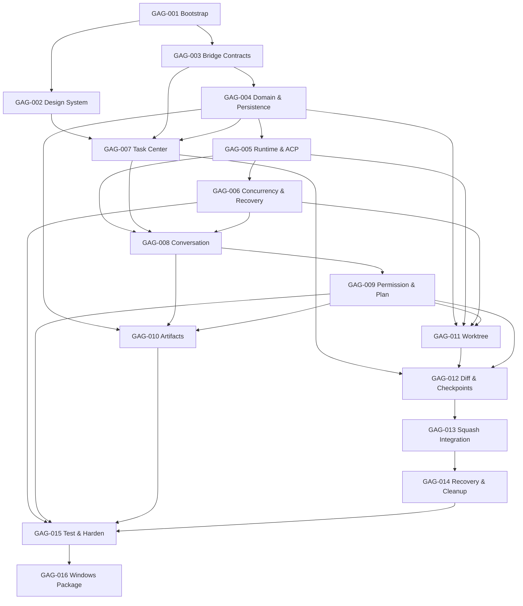

# Grok ACP GUI AI 开发路线图

## 1. 使用方式

本文件只负责任务顺序、依赖、模型与质量门禁。实施者必须打开对应 `docs/tasks/GAG-*.md`；不得仅根据本表开发。所有任务遵守根 `AGENTS.md`。

## 2. 模型策略

采用质量/成本均衡：Sol 处理并发、安全与 Git 破坏性流程；Terra 处理常规跨层工作；Luna 仅做机械性辅助；DeepSeek V4 Pro 处理状态/数据/Git 算法；V4 Flash 处理确定性基线；Grok 4.5 处理 Grok 语义、UI 与多模态。

难度：D1 机械低风险；D2 局部稳定；D3 多文件/单层状态；D4 跨层/持久化/协议；D5 并发、安全、破坏性和恢复。

| Task | 难度 | 首选 | 备选 | 交付核心 |
|---|---:|---|---|---|
| GAG-001 | D3 | DeepSeek V4 Flash 正式版 | GPT-5.6 Terra | Fork、清理、重命名、骨架 |
| GAG-002 | D3 | Grok 4.5 | GPT-5.6 Terra | Mocha Token、UI壳 |
| GAG-003 | D4 | GPT-5.6 Sol | DeepSeek V4 Pro | DesktopBridge 契约 |
| GAG-004 | D4 | DeepSeek V4 Pro | GPT-5.6 Sol | 状态机、SQLite |
| GAG-005 | D5 | GPT-5.6 Sol | Grok 4.5 | Runtime、ACP |
| GAG-006 | D5 | GPT-5.6 Sol | DeepSeek V4 Pro | 并发、恢复 |
| GAG-007 | D3 | GPT-5.6 Terra | Grok 4.5 | Task Center |
| GAG-008 | D4 | Grok 4.5 | GPT-5.6 Sol | 对话、工具时间线 |
| GAG-009 | D5 | GPT-5.6 Sol | DeepSeek V4 Pro | 权限、Plan gate |
| GAG-010 | D4 | Grok 4.5 | GPT-5.6 Terra | 图片、Artifact |
| GAG-011 | D5 | GPT-5.6 Sol | DeepSeek V4 Pro | Worktree 生命周期 |
| GAG-012 | D4 | DeepSeek V4 Pro | GPT-5.6 Sol | Diff、检查点 |
| GAG-013 | D5 | GPT-5.6 Sol | DeepSeek V4 Pro | Squash 集成 |
| GAG-014 | D5 | GPT-5.6 Sol | DeepSeek V4 Pro | 恢复、清理 |
| GAG-015 | D5 | GPT-5.6 Sol | DeepSeek V4 Pro | 测试、加固 |
| GAG-016 | D3 | GPT-5.6 Terra | DeepSeek V4 Flash 正式版 | Windows 打包 |

Luna 仅用于批量路径/名称更新、既有模式测试补全、快照/文档同步和明确局部修复。连续两次同一验收失败升级 Terra；Terra/Grok 遇跨层不一致、安全或竞态升级 Sol；D5 合并前需不同旗舰模型审查。

模型定位依据用户指定的官方说明：[GPT-5.6](https://openai.com/index/gpt-5-6/)、[DeepSeek V4](https://api-docs.deepseek.com/news/news260424/)、[Grok 4.5](https://docs.x.ai/developers/models/grok-4.5)。执行任务前应确认当前平台可用的准确模型标识；不得因模型不可用而静默降级，替换情况必须写入交付报告。

## 3. 依赖图

## 4. 执行阶段

### Phase A：基线与契约

- GAG-001 必须先完成。
- GAG-002 与 GAG-003 可并行，分别限制在前端视觉与 Bridge 契约。
- Gate A：项目可启动；Mocha Token 通过静态检查；Bridge 类型在 Rust/TS 有单一来源或生成策略。

### Phase B：领域与 Runtime

- GAG-004 完成状态机、Migration 和恢复基线。
- GAG-005、GAG-007 在满足依赖后可部分并行，但不能同时改 Bridge 公共类型。
- Gate B：Fake ACP 能完成握手/会话；任务状态可持久化；主界面能呈现 Snapshot。

### Phase C：核心交互

- GAG-006、GAG-008、GAG-009 完成并发、对话、权限和 Plan。
- GAG-010 可在 GAG-008 稳定后与 GAG-011 并行。
- Gate C：三会话事件不串线；Plan 写入负面测试通过；图片缓存可恢复。

### Phase D：Git 闭环

- GAG-011 → GAG-012 → GAG-013 → GAG-014 串行，避免 Git 规则和受管路径并行漂移。
- Gate D：目标工作区冲突时保持干净；恢复包失败阻止删除；所有 destructive 测试通过。

### Phase E：加固与交付

- GAG-015 汇总契约、集成、E2E、安全和性能门禁。
- GAG-016 只在前述检查通过后生成内部安装包。

## 5. 共享文件冲突

| 区域 | 独占任务 |
|---|---|
| `src/bridge/*`、Rust bridge DTO | GAG-003；后续修改需任务明确授权 |
| `src/shared/theme/*` | GAG-002 |
| `src-tauri/migrations/*` | GAG-004，后续任务只能新增 Migration |
| Composition root、Tauri capabilities | GAG-001/GAG-003/GAG-016 按顺序 |
| Workspace public Interface | GAG-011，GAG-012–014 只能兼容扩展 |
| CI required checks | GAG-015/GAG-016 |

## 6. 需求到任务追踪

PRD 第 9 节是完整追踪矩阵；本路线图按实施批次给出同一组 ID 的主责归属，所有测试族最终由 GAG-015 汇总。

| 需求 | UI | Module | 主责 Task | 测试族 |
|---|---|---|---|---|
| FR-RUNTIME-001～005 | UI-ONBOARD-001、UI-SETTINGS-001、UI-ERROR-001 | MOD-AGENT-RUNTIME、MOD-PERSISTENCE | GAG-003～005、GAG-016 | TST-RUNTIME |
| FR-PROJECT-001～004、FR-TASK-001～004 | UI-PROJECT-001、UI-TASK-001、UI-TASK-002 | MOD-TASK-RUNTIME、MOD-WORKSPACE、MOD-PERSISTENCE | GAG-004、GAG-006～007、GAG-011 | TST-PROJECT、TST-TASK |
| FR-SESSION-001～005 | UI-CONV-001、UI-RECOVERY-001 | MOD-AGENT-RUNTIME、MOD-TASK-RUNTIME | GAG-005～006、GAG-008 | TST-SESSION |
| FR-PERMISSION-001～003、FR-PLAN-001～002 | UI-PERM-001、UI-PLAN-001 | MOD-AGENT-RUNTIME、MOD-TASK-RUNTIME | GAG-009 | TST-PERMISSION、TST-PLAN |
| FR-IMAGE-001～005 | UI-ARTIFACT-001 | MOD-ARTIFACTS、MOD-PERSISTENCE | GAG-010 | TST-ARTIFACT |
| FR-WORKTREE-001～005 | UI-WORKTREE-001、UI-RECOVERY-001 | MOD-WORKSPACE、MOD-PERSISTENCE | GAG-011、GAG-014 | TST-WORKTREE |
| FR-REVIEW-001～005 | UI-REVIEW-001、UI-RECOVERY-001 | MOD-WORKSPACE、MOD-PERSISTENCE | GAG-012～014 | TST-REVIEW |
| FR-RECOVERY-001～003 | UI-RECOVERY-001、UI-TASK-002 | MOD-TASK-RUNTIME、MOD-WORKSPACE、MOD-ARTIFACTS | GAG-006、GAG-014 | TST-RECOVERY |
| 全部 NFR | 全部 | 全部 | 各功能任务、GAG-015、GAG-016 | TST-SECURITY、TST-PERFORMANCE、TST-RELIABILITY、TST-A11Y、TST-PRIVACY |

## 7. 路线图完成定义

- 16 个任务的 Definition of Done 均满足。
- 所有 FR/NFR 有自动化或明确手工验收证据。
- D5 任务存在独立旗舰模型审查记录。
- Windows 安装包可在干净机器完成首次启动主路径。
- 文档与实际 Interface、状态、Migration 和命令保持同步。
